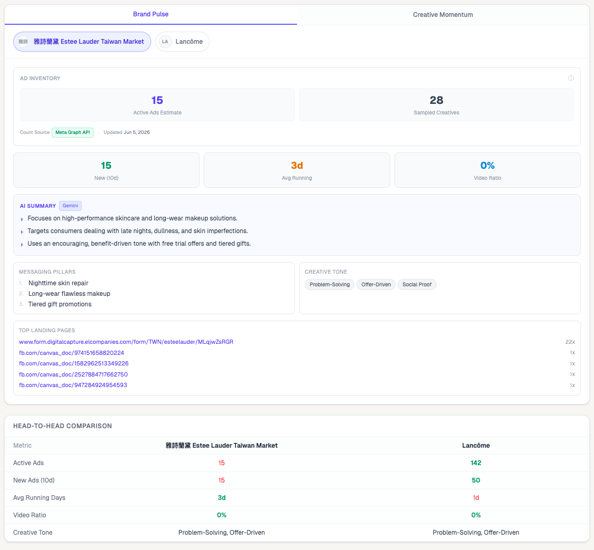
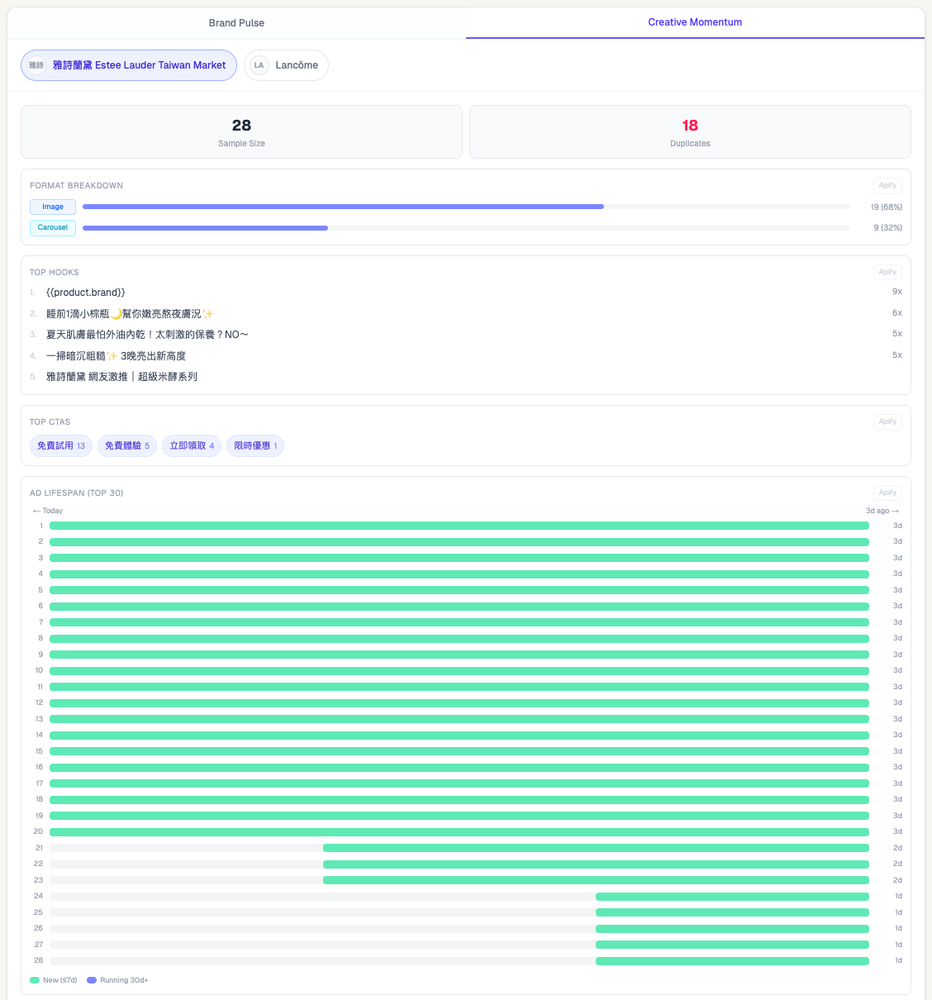

# Competitor Pulse

A lightweight competitor intelligence dashboard for marketers, growth teams, and brand managers who need to monitor competitor advertising activity on Meta — without manually checking the Ads Library every week.

---

## What This Solves

The Meta Ads Library gives you raw ad data. It does not tell you what to do with it.

Competitor Pulse turns that raw data into actionable intelligence:

- How intensely is a competitor advertising right now?
- Which creative formats are they betting on?
- Which ads have survived long enough to prove themselves?
- What hooks and CTAs are showing up repeatedly?
- Which landing pages are being driven the most traffic?

The goal is not to replicate Meta Ad Library. The goal is to provide a practical competitor monitoring workflow for teams that need to move fast.

---

## Demo

Try the built-in **Estée Lauder vs Lancôme (TW)** preset, or paste any Facebook page URL.

| Brand | URL |
|---|---|
| Estée Lauder Taiwan | `https://www.facebook.com/esteelaudertw/` |
| Lancôme Taiwan | `https://www.facebook.com/LancomeTW/` |

These two brands were chosen as the default demo because they operate in the same market (Taiwan), the same product category (prestige beauty), and have meaningfully different advertising intensities — making the comparison more instructive than generic examples.

The app runs in **demo mode** with realistic mock data when no API keys are configured. No setup required to evaluate the UI.

### Brand Pulse



### Creative Momentum



---

## Dashboard Overview

### Brand Pulse

Answers the inventory question: how aggressively is this brand advertising right now?

| Question | Metric |
|---|---|
| How many ads are currently running? | Active Ads Estimate |
| How recently are they launching new ads? | New Ads (10d) |
| How long are ads staying active on average? | Avg Running Days |
| What share of their ads use video? | Video Ratio |

Metrics come from two MCP calls, both country-filtered, stored at dev-time via `npm run enrich`:

- **Active Ads Estimate** — true full-inventory count from `estimated_total_count`
- **New Ads (10d), Avg Running Days, Video Ratio** — derived from the 50 most recently created active ads (recency sample). These are sample-based approximations, not full-inventory figures.

The tab also surfaces AI-generated insights from Gemini Flash: messaging pillars, creative tone, and a summary of the brand's advertising angle.

### Creative Momentum

Answers the creative question: what is this brand running, and what is working?

| Question | Metric |
|---|---|
| Which ad formats are most common? | Format Breakdown |
| What opening lines appear most frequently? | Top Hooks |
| Which CTA phrases show up across ads? | Top CTAs |
| Which ads have been running the longest? | Ad Survival Ranking + Lifespan Gantt |
| Which landing pages are used most? | Top Landing Pages |

All Creative Momentum metrics are derived from the Apify creative sample — the top 50 active ads ranked by impressions.

---

## Metrics Reference

### Active Ads Estimate

- **Definition:** Total number of active ads in Meta's Ads Library for this brand, filtered by the selected country
- **Source:** Meta Graph API (`summary.estimated_total_count`) via MCP enrichment
- **Updated:** Dev-time via `npm run enrich` — not recalculated on every page load
- **Note:** This is the same number shown in the Meta Ads Library UI. It reflects the true inventory, not the size of the creative sample.

### New Ads (10d)

- **Definition:** Number of ads in the MCP recency sample whose delivery start date falls within the last 10 days
- **Source:** MCP recency sample (50 most recently created active ads)
- **Formula:** Count of ads where `ad_delivery_start_time ≥ today − 10 days`

### Avg Running Days

- **Definition:** Mean number of days active ads have been running, measured from their delivery start date to today
- **Source:** MCP recency sample
- **Formula:** `mean(today − ad_delivery_start_time)` across all ads with a known start date

### Video Ratio

- **Definition:** Percentage of ads in the Apify creative sample that are video format
- **Source:** Apify — `snapshot.videos` array; format detected per creative at runtime
- **Formula:** `video_count / ads_with_known_format × 100`
- **Note:** Returns null if the sample contains no ads with detectable format. MCP does not return format fields, so this metric is computed from the Apify sample even though it appears alongside MCP-sourced KPIs.

### Sample Size

- **Definition:** Number of ad creatives downloaded from Apify for this brand
- **Source:** Apify scraper output
- **Note:** Capped at 50 per brand. See Limitations.

### Format Breakdown

- **Definition:** Distribution of ad formats (Video / Image / Carousel) across the Apify creative sample
- **Source:** Apify — `format` field detected by scraper
- **Note:** Apify-sourced. May differ from Video Ratio (which is MCP-sourced) due to different sample populations.

### Top Hooks

- **Definition:** The most frequently recurring opening lines across all sampled ad creatives
- **Source:** Apify — first non-empty line of each ad's copy text
- **Formula:** Group by normalized first line, rank by count descending

### Top CTAs

- **Definition:** The most common call-to-action phrases appearing across sampled creatives
- **Source:** Apify — regex + keyword match against a curated CTA list (English + Traditional Chinese)
- **Note:** One match per ad per phrase. Returns null count if no known CTAs are detected.

### Ad Survival Ranking

- **Definition:** All sampled creatives ranked by how long they have been actively running
- **Source:** Apify — `startDate` field per creative
- **Interpretation:** Long-running ads have proven themselves. If an ad has been running 30+ days, the advertiser has likely seen positive signal.

### Top Landing Pages

- **Definition:** Most frequently used destination URLs across the creative sample
- **Source:** Apify — `landingPage` field extracted from ad link targets
- **Formula:** Count unique `hostname + pathname` occurrences, return top 5

---

## Data Architecture

Two distinct data sources serve fundamentally different purposes in this tool.

```
┌─────────────────────────────────────────────────────────────────┐
│  MCP / Meta Graph API — Inventory Intelligence Layer            │
│                                                                 │
│  What it answers:  How big is this brand's ad operation?        │
│  Fetch timing:     Dev-time only (npm run enrich)               │
│  Stored in:        data/enriched-counts.json                    │
│  Country filter:   Yes — counts are filtered by selected market │
│                                                                 │
│  Metrics:  estimatedActiveAdsCount, newAds10d,                  │
│            avgRunningDays, videoRatio                           │
├─────────────────────────────────────────────────────────────────┤
│  Apify — Creative Asset Layer                                   │
│                                                                 │
│  What it answers:  What creatives are they running?             │
│  Fetch timing:     Runtime, on each analysis request            │
│  Limit:            50 ads per brand, sorted by impressions      │
│                                                                 │
│  Metrics:  Format breakdown, hooks, CTAs, lifespan,             │
│            landing pages, ad copy                               │
└─────────────────────────────────────────────────────────────────┘
```

### Why this separation matters

A brand with 800 active ads will return exactly 50 creatives from Apify. Displaying "50 active ads" as the inventory would be misleading. Competitor Pulse displays both numbers explicitly — the real total from MCP and the sample size from Apify — with source badges so the reader always knows what they are looking at.

### Enrichment workflow

MCP-sourced metrics are fetched at development time and stored locally. The Next.js app reads from the JSON file at request time and never calls MCP or the Graph API directly.

```bash
# Enrich all default brands
npm run enrich

# Enrich a single brand (with country filter)
npx tsx scripts/enrich-meta-counts.ts --pageId 156514087702491 --brand "Lancôme Taiwan" --country TW
```

---

## Known Limitations

### Apify creative sample is capped at 50

The scraper is intentionally configured with `limitPerSource: 50`. This keeps operating cost low and is appropriate for a portfolio/demo use case.

For brands running more than 50 active ads, creative-level metrics (format breakdown, hooks, CTAs, ad survival ranking) reflect the top 50 by impression rank — not the full inventory. High-impression ads are likely the brand's primary active creatives, so this sample is still representative for most analysis purposes.

### MCP has no pagination

The `ads_library_search` MCP tool returns a maximum of 50 ads per call with no cursor, offset, or date-range filtering. This means:

- For high-volume brands (e.g. a brand launching 50+ ads per week), the MCP recency sample may cover only the current week
- `newAds10d` will saturate at 50 for brands with very high launch velocity
- Full launch velocity and historical trend analysis are not available through this API

### MCP data is not real-time

`estimatedActiveAdsCount` and related KPIs are fetched at development time and stored in `data/enriched-counts.json`. The dashboard does not refresh this data automatically. Run `npm run enrich` to update.

---

## Trade-offs and Design Decisions

### Why MCP for inventory, not Apify?

Apify returns the top N creatives by impressions. Using that count as the inventory number would consistently underreport brands with large ad libraries. MCP's `estimated_total_count` reflects the actual library size, regardless of how many creatives the scraper fetches. It is the only honest number to show for "Active Ads."

### Why Apify for creatives?

Apify provides reliable access to creative images, videos, landing page URLs, and ad copy in a structured format. The Meta Ads Library does not expose creative assets through a public API, so scraping is the only available path for creative-level analysis.

### Why cap Apify at 50?

Each Apify run costs roughly $0.04 per brand. Increasing to 500 ads would increase cost 10×. For the analysis questions this tool answers — creative formats, hook patterns, CTA language, ad survival — 50 impression-ranked ads provide a representative sample. The cap is a deliberate product decision, not a technical limitation.

### Why not compute everything from Apify?

Creative samples are useful for identifying patterns across active ads. They are not useful as a proxy for inventory size, launch velocity, or historical trend analysis. Mixing those concerns leads to misleading metrics.

---

## Tech Stack

| Layer | Technology |
|---|---|
| Framework | Next.js 15 (App Router, TypeScript strict mode) |
| Styling | Tailwind CSS v4 |
| Ad Scraping | Apify — `curious_coder/facebook-ads-library-scraper` |
| Inventory Data | Meta Graph API via MCP (dev-time enrichment only) |
| AI Analysis | Google Gemini Flash (`@google/generative-ai`) |
| Storage | Local JSON (`data/enriched-counts.json`) |

---

## Running Locally

```bash
git clone https://github.com/laurakeita/competitor-pulse.git
cd competitor-pulse
npm install
cp .env.example .env.local
npm run dev
```

Open [localhost:3000](http://localhost:3000). The app loads mock data automatically if no API keys are set.

### Environment variables

```
APIFY_API_TOKEN=      # from console.apify.com — required for live scraping
GEMINI_API_KEY=       # from aistudio.google.com — required for AI summaries
FACEBOOK_ACCESS_TOKEN= # Meta Ads MCP token — required for npm run enrich only
```

---

## Docs

- [Data Sources](docs/DATA_SOURCES.md) — detailed notes on Apify and MCP integration
- [Limitations](docs/LIMITATIONS.md) — what `sampledAdsCount` does and does not mean

---

Built by [Laura Keita](https://github.com/laurakeita) · Growth Marketing & Strategy Operations
